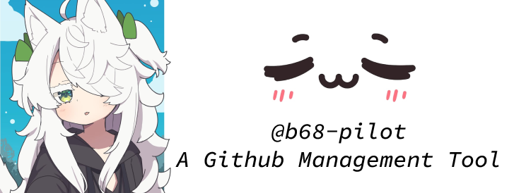

# b68-pilot, the engine for @b68web

<p align="center">
    
</p>

[@b68web](https://github.com/b68web)'s GitHub App bot to manage GitHub activities.

## ✨ Features

### 🚀 Release Management
- **Auto-release on PR merge** — Add `release:patch`, `release:minor`, or `release:major` label to a PR. When merged, the bot automatically creates a tag, generates release notes, and creates a GitHub Release.
- **Manual tag/release** — `@b68-pilot tag v1.2.3` or `@b68-pilot release v1.2.3`
- **Changelog generation** — Auto-updates `CHANGELOG.md` on release (configurable)

### 🔀 PR Automation
- **Auto-labeling** — Labels PRs by file patterns (`.github/labeler.yml`), size (S/M/L/XL), and conventional commit prefix (`feat:`, `fix:`, etc.)
- **Auto-merge** — `@b68-pilot automerge` to queue PR for merge when approved + checks pass
- **Review assignment** — Auto-assigns reviewers on PR open (round-robin, CODEOWNERS, or load-balancing)

### 📋 Issue Management
- **Stale issues** — Auto-labels and closes inactive issues after configurable period (default: 15 days)
- **Issue triage** — Auto-labels issues based on keywords in title/body

### 🔔 Notifications
- **Discord integration** — Sends batched notifications per-repo to Discord channels
- **Daily digest** — Activity summary sent daily at 9 AM

### 📊 Analytics
- **Activity reports** — `@b68-pilot stats` shows PR/issue stats, top contributors

### 🛠️ Existing Features
- **Webhook commands** — `close`, `approve`, `merge`, `summarize`, `status`
- **CLI** — `b68 login`, `work`, `close`, `approve`, `merge`, `review`, `assign`, `comment`, `summarize`, `stats`
- **Reconciliation** — Syncs work items from GitHub every 5 minutes

## 🤖 Bot Commands

| Command | Description |
|---------|-------------|
| `@b68-pilot close` | Close issue/PR |
| `@b68-pilot approve` | Approve PR |
| `@b68-pilot merge` | Merge PR |
| `@b68-pilot summarize` | Generate PR diff summary |
| `@b68-pilot status` | Bot health check |
| `@b68-pilot tag v1.2.3` | Create tag on current commit |
| `@b68-pilot release v1.2.3` | Create release with auto-generated notes |
| `@b68-pilot automerge` | Queue PR for auto-merge |
| `@b68-pilot automerge cancel` | Remove PR from auto-merge queue |
| `@b68-pilot stale` | Check stale issues |
| `@b68-pilot stale --exclude` | Exempt issue from stale check |
| `@b68-pilot stats` | Show activity stats (7 days) |
| `@b68-pilot stats 30d` | Show stats for period |

## 💻 CLI Commands

```bash
b68 login                              # Device flow login
b68 logout                             # Clear stored credentials
b68 whoami                             # Show logged in user
b68 installations                      # List app installations
b68 work [--repo owner/name]           # Show work items
b68 close owner/repo#123               # Close issue/PR
b68 approve owner/repo#123             # Approve PR
b68 merge owner/repo#123               # Merge PR
b68 review owner/repo#123 "message"    # Request changes
b68 assign owner/repo#123 [username]   # Assign user
b68 comment owner/repo#123 "message"   # Post comment
b68 summarize owner/repo#123           # PR diff summary
b68 tag owner/repo v1.2.3              # Create tag
b68 release owner/repo v1.2.3          # Create release
b68 stats owner/repo [days]            # Activity stats
```

## 📦 Workspaces

- [core](./packages/core/README.md) — `@pilot/core` — Shared library (auth, API clients, commands, storage)
- [cli](./packages/cli/README.md) — `@pilot/cli` — User-facing CLI tool
- [worker](./packages/worker/README.md) — `@pilot/worker` — Webhook server + background jobs

## 🔧 GitHub App Setup

1. Create a GitHub App from `github-app.manifest.example.json` or configure one manually with the same permissions and events.
2. Enable **device flow** in the app settings for CLI login (no callback URL needed).
3. Copy `.env.example` to `.env` and fill in the app ID, private key, webhook secret, client ID, optional client secret, and app slug.
4. Install the app on the repositories the bot should manage.

## ⚙️ Configuration

```env
# Release Management
B68_AUTO_RELEASE=true
B68_DEFAULT_BUMP=patch
B68_RELEASE_LABELS=release:patch,release:minor,release:major,release:skip
B68_UPDATE_CHANGELOG=true
B68_CHANGELOG_PATH=CHANGELOG.md

# PR Automation
B68_SIZE_S=10
B68_SIZE_M=50
B68_SIZE_L=200
B68_SIZE_XL=500
B68_REVIEW_STRATEGY=round-robin
B68_REVIEWERS=user1,user2,user3

# Stale Management
B68_STALE_ENABLED=true
B68_STALE_DAYS=15
B68_STALE_CLOSE_DAYS=7
B68_STALE_EXEMPT_LABELS=pinned,security,bug
B68_STALE_BEHAVIOR=label-then-close
B68_STALE_LABEL=stale

# Issue Triage
B68_TRIAGE_RULES=bug:crash|error|exception,feature:request|enhancement

# Discord Notifications
B68_DISCORD_WEBHOOK_URL=
B68_DISCORD_EVENTS=issue,pull_request,release,stale
B68_DISCORD_BATCH_INTERVAL=300
```

## 🐳 Running with Docker Compose

```bash
# Start both webhook server and reconciliation worker
docker compose up -d

# View logs
docker compose logs -f

# Stop services
docker compose down
```

The webhook server listens on port 3131 by default. Configure the GitHub App webhook URL to point to `https://your-host/github/webhook`.

SQLite data is persisted in a Docker volume (`pilot-data`).

## 🏃 Running Locally

```bash
bun install
bun run build

# Webhook server
cd packages/worker
bun run webhook

# Reconciliation worker (cron)
cd packages/worker
bun run dev
```

Use a tunnel such as ngrok for local webhook testing and point the app webhook URL to `/github/webhook`.

## 📄 License

This project is Open Sourced and powered by [MIT](./LICENSE) License.

## 🙏 Acknowledgements

- [The Main Character Art](https://www.pixiv.net/en/artworks/146856884) - by [最速のゆっくり](https://www.pixiv.net/en/users/12244076)
- [UwU Face Art](https://www.magnific.com/premium-psd/kawaii-face-expression_94532993.htm) - by [freepik](https://www.magnific.com/author/freepik)
